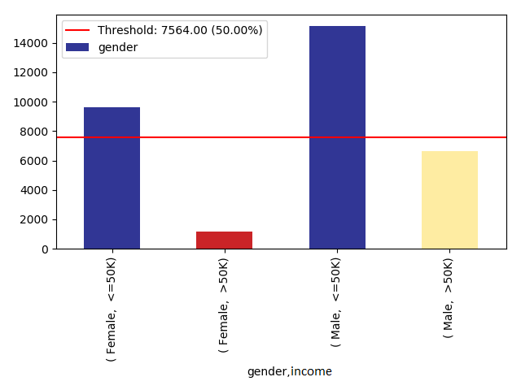
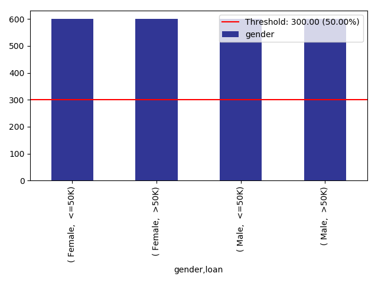
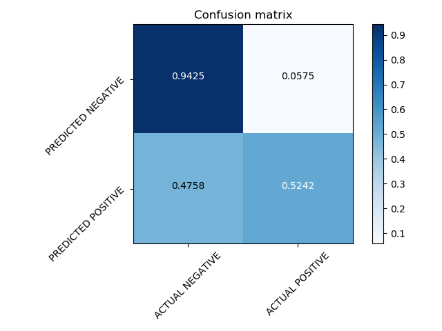
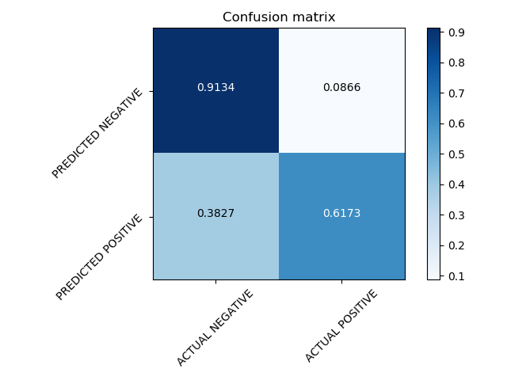

# Training with balanced and imbalanced data using the [xai](https://github.com/EthicalML/xai) toolbox

A comparison between a KNN-Classifier trained with balanced and imbalanced data using the [Census Income Data Set](https://archive.ics.uci.edu/ml/datasets/census+income) to predict weather a person makes over 50K a year.

This project consists of three main modules: **compare_models.py**, **train_balanced_model.py**, **train_imbalanced_model.py**.

- In *train_balanced_model.py* a KNN-Classifier is trained with data, that was balanced and the model is then saved in *Balanced_Model.pkl*.
- In *train_imbalanced_model.py* a KNN-Classifier is trained with raw data (imbalanced) and the model is then saved in *Imbalanced_Model.pkl*.
- In *compare_models.py* both saved models are loaded and compared using randomly generated data.

## Prerequisites

- Python: 3.7.4
  - Tensorflow: 1.13.1
  - xai: 0.0.5
  - Scikit-learn: 0.20.1
  - numpy: 1.16.0

## Results

When we analyze the raw data we could see that there are a lot more *Male* examples that earn *>50K* a year than the *Female*:


Therefore, we will balance the data for the balanced example:


After training the classifiers with both balanced and imbalanced data, the following results were achieved:

```bash
# Balanced data
$> 20-Oct-19 16:51:24 - Accuracy for the model is 0.7333333333333333
# Imbalanced data
$>20-Oct-19 16:52:33 - Accuracy for the model is 0.8403193612774451
```

Confusion matrix for the *"balanced"* model:


Confusion matrix for the *"imbalanced"* model:


> Additional plots such as ROCs could be found in the *img/* folder.

For manual testing purposes I have generated random examples and compared the predictions of both models. It is noticeable that the *"imbalanced"* model slightly (5 out of 500) disadvantages *Female* examples:

```
Person 5:
	age -> 30
	workclass ->  Federal-gov
	education ->  5th-6th
	education-num -> 3
	marital-status ->  Divorced
	occupation ->  Craft-repair
	relationship ->  Wife
	ethnicity ->  Black
	gender ->  Female
	capital-gain -> 1797
	capital-loss -> 2267
	hours-per-week -> 45
******************************************************************
		Balanced prediction for Person 5 is  >50K.
		Imbalanced prediction for Person 5 is  <=50K.
******************************************************************

...

Person 336: 
	age -> 55
	workclass ->  Local-gov
	education ->  Some-college
	education-num -> 3
	marital-status ->  Separated
	occupation ->  Transport-moving
	relationship ->  Own-child
	ethnicity ->  Amer-Indian-Eskimo
	gender ->  Female
	capital-gain -> 34095
	capital-loss -> 1411
	hours-per-week -> 49
******************************************************************
		Balanced prediction for Person 336 is  >50K.
		Imbalanced prediction for Person 336 is  <=50K.
******************************************************************

...

```
